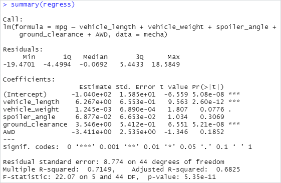
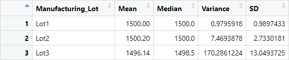
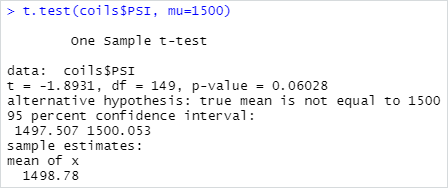
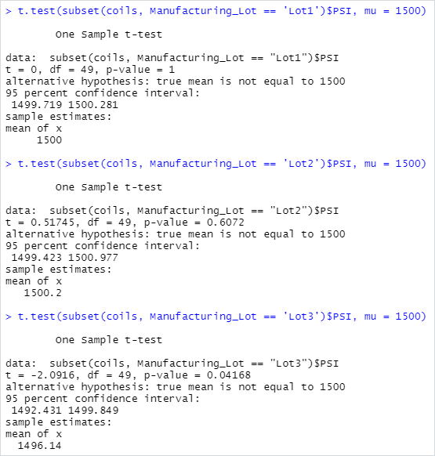

# MechaCar Statistical Analysis with R

## Module and Challenge Overview

In this module we analysis car-based datasets using R and various statistical methods. Using automotive-based datasets we covered creating plots using ggplot2, formulating null and alternate hypotheses testing, and linear regression. We also briefly look at evaluating one- and two-sample t-tests, ANOVA (analysis of variance) models, and chi-squared tests. We also enter a discussion over A/B testing and determining the most appropriate statistical test for a given hypothesis and dataset.

<!-- Include overview of the challenge here. -->

## Linear Regression to Predict MPG

In Deliverable 1 we perform a multiple linear regression analysis on the `MechaCar MPG` dataset. We read in the CSV file, creating a data frame. We perform a linear regression analysis by using the `lm()` function. This function takes in a variable interpretation statement of the form `Y ~ A + B`, so we pass the dependent variable `mpg` as Y, and the other columns with the `+` operator, which is saved to a variable:

```r
regress <- lm(mpg ~ vehicle_length + vehicle_weight + spoiler_angle + ground_clearance + AWD, data = mecha)
```

We then wrap this in a `summary()` function to find the p-value and the r-squared value, shown in the console output screenshot below:



From the screenshot we can see the whole model has a **p-value** of `5.35e-11` (implying a significant result), and an **r-squared** value of `0.7149`.

***Which variables/coefficients provided a non-random amount of variance to the mpg values in the dataset?***

From the individual p-values shown in the screenshot for each variable (`Pr(>|t|)`) we can see that, as well as the intercept, `vehicle_length` with a p-value of `2.60e-12` and `ground_clearance` with a p-value of `5.21e-08` provide a non-random amount of variable to the `mpg` values in the dataset. This means, with low p-values, `vehicle_length` and `ground_clearance` have a statistically significant impact on the `mpg` values for the dataset. The intercept having a low p-value (`5.08e-08`) means that it explains a significant amount of variability in the dependent variable when all independent variables are zero. *Due to this, we may need to look at scaling or transforming the data to help improve the predictive power of the model.*

***Is the slope of the linear model considered to be zero? Why or why not?***

When dealing with multiple linear regression we set our **null hypothesis** to state: H<sub>0</sub> – the slope of the linear model is zero, or m = 0. With a p-value of `5.35e-11` and a standard significance level of `0.05` we can state there is sufficient evidence to reject the null hypothesis. Meaning the slope of our linear model is **non-zero**.

***Does this linear model predict mpg of MechaCar prototypes effectively? Why or why not?***

With an r-squared value of `0.7149` we can say our model is statistically significant and predicts the `mpg` 70% of the time. This value falls into a higher-correlation subgroup of r-squared values so we could say the model predicts somewhat strongly. In a real-world setting we would want to decide on an acceptable r-squared value before performing analysis to remove bias. We are not given any boundaries for this value in the assignment so we can only go off our own intuition, which is to say, yes, this model does predict `mpg` fairly effectively, but leaves a lot of room for growth.

## Summary Statistics on Suspension Coils

In Deliverable 2 we read in the `Suspension_Coils` dataset and create a second data frame. We create a total summary of this dataset using the `summarize()` function, chaining the functions with the pipe operator `%>%`. In our summary data frame, we want to find out the Mean, Median, Variance and Standard Deviation of the data, so we pass in the corresponding functions, assigning the values to columns of the same names:

```r
total_summary <- coils %>% summarize(Mean=mean(PSI), Median=median(PSI), Variance=var(PSI), SD=sd(PSI))
```
 Which produces the new `total_summary` data frame:


We also want to view similar summary statistics but grouped into lot numbers. The `Manufacturing_Lot` column of the dataset contains the different categories of Lot - `Lot1`, `Lot2`, and `Lot3`. So, we must first group by this column before running the same `summarize()` function.

```r
lot_summary <- coils %>% group_by(Manufacturing_Lot) %>%
  summarize(Mean=mean(PSI), Median=median(PSI), Variance=var(PSI), SD=sd(PSI))
```

Producing the `lot_summary` data frame:



***The design specifications for the MechaCar suspension coils dictate that the variance of the suspension coils must not exceed 100 pounds per square inch. Does the current manufacturing data meet this design specification for all manufacturing lots in total and each lot individually? Why or why not?***

From the `total_summary` data frame we can see that with **all the suspension coils combined, the variance falls in the limits of the design specification** - `62.29356` being less than the required `100`. However, when separating the coils and grouping them into their `Manufacturing_Lot`'s we see that `Lot3` does not. `Lot1` and `Lot2`, have good variance values, easily within the design specification, `0.9795918` and `7.4693878` respectively. `Lot3` though has a variance of `170.2861224` which is far from the design specification, meaning `Lot3` **exceeds 100 pounds per square inch in variance**.

## T-Tests on Suspension Coils

In Deliverable 3 we continue our analysis on the `Suspension_Coils` dataset, by performing Student's t-tests on the PSI column. First, we remind ourselves of the hypotheses being tested by this analysis:

- H<sub>0</sub> - there is **no statistical difference** between the observed sample mean and its presumed population mean.
- H<sub>a</sub> – there is **a statistical difference** between the observed sample mean and its presumed population mean.

 Then we use the `t.test()` function on the whole dataset (the full PSI column), passing in the population mean, mu, as `1500` (given in the challenge).

```r
t.test(coils$PSI, mu = 1500)
```

Which produces our t-test console output:



Here we can see our p-value is




<!--
Using your knowledge of R, perform t-tests to determine if all manufacturing lots and each lot individually are statistically different from the population mean of 1,500 pounds per square inch.-->

In your README, create a subheading ## T-Tests on Suspension Coils, then briefly summarize your interpretation and findings for the t-test results. Include screenshots of the t-test to support your summary.


## Context

This is the result of Module 15 of the University of Toronto School of Continuing Studies Data Analysis Bootcamp Course - **Statistics and R** - AutosRUs Automotive Manufacturing Analysis with R. Following the guidance of the module we end up pushing this selection of files to GitHub.
